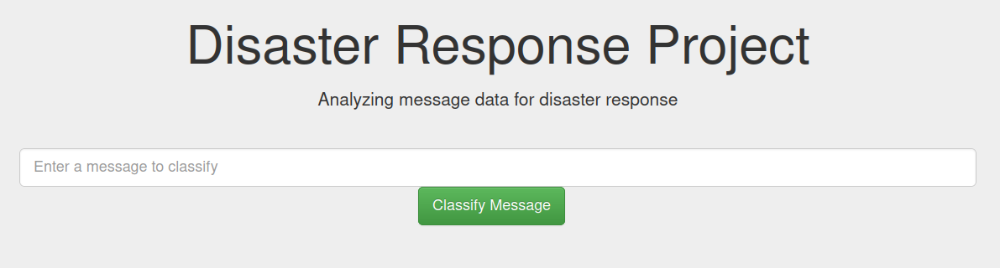

<div id="top"></div>

<!-- PROJECT LOGO -->
<br />
<div align="center">
  

  <h3 align="center">Classifying Disaster Response Messages in a Data App</h3>

</div>

<!-- TABLE OF CONTENTS -->
<details>
  <summary>Table of Contents</summary>
  <ol>
    <li>
      <a href="#about-the-project">About The Project</a>
      <ul>
        <li><a href="#premise">Premise</a></li>
        <li><a href="#execution-plan">Execution Plan</a></li>
        <li><a href="#data">Data</a></li>
        <li><a href="#challenges-and-improvements">Challenges and improvements</a></li>
      </ul>
    </li>
    <li>
      <a href="#getting-started">Getting Started</a>
      <ul>
        <li><a href="#setting-up-a-conda-environment">Setting up a conda environment</a></li>
        <li><a href="#file-descriptions">File descriptions</a></li>
        <li><a href="#usage">Usage</a></li>
      </ul>
    </li>
    <li><a href="#additional-notes">Additional Notes</a></li>
    <li><a href="#license">License</a></li>
    <li><a href="#contact">Contact</a></li>
    <li><a href="#acknowledgments">Acknowledgments</a></li>
  </ol>
</details>

---
## About The Project

In this mini-project, I developed a data pipeline as well as a machine learning pipeline to process and model messages sent during disaster events. The goal is to be able to predict which type of disaster a message is referring to.

### Premise

When a disaster occurs, such as forest fires or floods, emergency response teams are swamped by thousands of messages they need to go through. Not only do emergency responders need to filter out the relevant messages related to the events, but they must must be able to categorize and forward the messages to the appropiate personnel.

For example, a tornado might damage different infraestructures that need to be addressed by different response teams. Messages about road damage would be of little use to the teams maintaining and monitoring the energy grid. Ensuring that each response team gets the information they need is key for a fast and effective response.

Therefore, a web app where emergency response workers can input a message and receive the category or categories it belongs to would be of great help when managing and coordinating a disaster event.

<p align="right">(<a href="#top">back to top</a>)</p>

### Data

This project uses disaster data from [Appen](https://appen.com/) (formerly Figure 8) to build a model for an API that classifies disaster messages. Data is split into two datasets:

- **Messages**: Contains all messages, their original text if they were translated and the source of the messages.
- **Categories**: A multi-label annotation of all messages into 34 categories. Some messages are annotated with more than one label, whereas some messages don't belong to any of the categories.

<p align="right">(<a href="#top">back to top</a>)</p>

### Execution plan

In order to process the data and build the classification model, two pipelines were developed:

  - **Data Pipeline:** Loads, clean and saves the data into a SQLite database.
  - **Machine Learning Pipeline**: Fine-tunes a Machine Learning (ML) classifier to predict message categories. It uses text features extracted using Natural Language Processing (NLP).

The best estimator found in the ML pipeline will then be used, through a Flask app, to build a web app for the classification of disaster response messages.

### Challenges and improvements

No project can ever be finished 100%, there is always something that can be improved upon. However, it is important to recognize when diminishing marginal returns start manifesting to signal the end of a project. Nonetheless, there were some aspects in the project that could have deserved more attention.

In the data processing steps, it became apparent that a considerable amount of samples (>2k) where not annotated to any labels. It was not clear the reason behind this. Perhaps they were meant as a control for false positives, or perhaps they were the result of annotation errors. For simplicity, these unannotated samples were kept in the dataset.

Machine learning is a booming field with new tools and methods being released almost on a daily basis. It is thus immediately obvious that the space of possible methods to try, from feature extractors to classification algorithms is nearly infinite.

Trying to find the best machine learning solution to the problem was outside of the scope of this project. The focus was instead on following the correct metholody to solve a data problem. Apart from that, I did not possess the necessary computational resources nor the time to do so. In any case, there are a few topics that I believe could need further consideration:

  - Performing stratified data splits is an unsolved problem for multi-label classification. However, when not addressed, it can greatly affect the learning procedure of multi-label classifiers. Especially when big data is not available, the chances of having too few instances of a certain label combination when training or testing the model is very high.
  - This project uses a single classifier for multi-label classification. However, another valid approach could have been to train a single classifier for each label separately, and then concatenate the predictions as a final output for each message. In this scenario, stratified data splits would not have been an issue.
  - Another important point when evaluating a model is to use as much available data as possible in a smart way. This is the reason why I decided to use all data to train the final model that would be used in the web app, after having found the optimal hyper-parameters on a subset of the data. However, for evaluation, a single train/test split is not informative enough. The split can give a biased view of the goodness of the model depending on dataset size, sample heterogeneity and label distribution.
    Ideally, one would use two K-fold cross validation loops. The outer one divides the data into train and test. Then, the train data is further split into train and validation. The model hyper-parameters are tuned on the new training set and tested on the validation set. This procedure will give a more robust sense of the goodness of the model.

<p align="right">(<a href="#top">back to top</a>)</p>

---

## Getting Started

To make use of this project, I recommend managing the required dependencies with Anaconda.

### Setting up a conda environment

Install miniconda:

```bash
wget https://repo.anaconda.com/miniconda/Miniconda3-latest-Linux-x86_64.sh
bash Miniconda3-latest-Linux-x86_64.sh
```

Install mamba:

```bash
conda install -n base -c conda-forge mamba
```

Install environment using provided file:

```bash
mamba env create -f environment.yml # alternatively use environment_hist.yml if base system is not debian
mamba activate disaster_response
```

### Usage

Both the data pipeline (`src/data/process_data.py`) and the machine learning pipeline (`src/models/train_classifier.py`) use [Typer](https://typer.tiangolo.com/) to offer a convenient command line tool.

#### Data Pipeline

To execute the data pipeline with default options, run the following command:

```bash
python src/data/process_data.py
```

Available options for the data pipeline:

```bash
python src/data/process_data.py --help
```

```text
 Usage: process_data.py [OPTIONS] [MESSAGES_FILEPATH] [CATEGORIES_FILEPATH]             
                        [DATABASE_FILEPATH]

 ETL pipeline for disaster response data.

╭─ Arguments ──────────────────────────────────────────────────────────────────────────╮
│   messages_filepath        [MESSAGES_FILEPATH]    File path to disaster messages     │
│                                                   dataset.                           │
│                                                   [default:                          │
│                                                   /home/uziel/Development/disaster_… │
│   categories_filepath      [CATEGORIES_FILEPATH]  File path to disaster categories   │
│                                                   dataset.                           │
│                                                   [default:                          │
│                                                   /home/uziel/Development/disaster_… │
│   database_filepath        [DATABASE_FILEPATH]    File path to final database to     │
│                                                   store cleaned and pre-processed    │
│                                                   data in.                           │
│                                                   [default:                          │
│                                                   /home/uziel/Development/disaster_… │
╰──────────────────────────────────────────────────────────────────────────────────────╯
╭─ Options ────────────────────────────────────────────────────────────────────────────╮
│ --help          Show this message and exit.                                          │
╰──────────────────────────────────────────────────────────────────────────────────────╯
```

#### Machine Learning Pipeline

To execute the machine learning pipeline with default options, run the following command:

```bash
python src/models/train_classifier.py
```

Available options for the machine learning pipeline:

```bash
python src/models/train_classifier.py --help
```

```text
 Usage: train_classifier.py [OPTIONS] [DATABASE_FILEPATH] [RESULTS_PATH]

 Machine Learning pipeline for disaster response data.

╭─ Arguments ──────────────────────────────────────────────────────────────────────────╮
│   database_filepath      [DATABASE_FILEPATH]  File path to sqlite database           │
│                                               containing input data.                 │
│                                               [default:                              │
│                                               /home/uziel/Development/disaster_resp… │
│   results_path           [RESULTS_PATH]       Directory to save results to,          │
│                                               including model and metrics.           │
│                                               [default:                              │
│                                               /home/uziel/Development/disaster_resp… │
╰──────────────────────────────────────────────────────────────────────────────────────╯
╭─ Options ────────────────────────────────────────────────────────────────────────────╮
│ --random-seed        INTEGER  Seed to initialize random state. [default: 8080]       │
│ --n-splits           INTEGER  Number of K-fold cross-validation splits. [default: 4] │
│ --n-jobs             INTEGER  Number of jobs to run in parallel for Grid Search      │
│                               hyper-parameter tuning.                                │
│                               [default: 10]                                          │
│ --help                        Show this message and exit.                            │
╰──────────────────────────────────────────────────────────────────────────────────────╯
```

#### Web App

Finally, the web app can be started with the following command:

```bash
python src/app/run.py
```

Then, go to http://0.0.0.0:3001/ to interact with the app.

### File descriptions

The project files are structured as follows:

- `data/disaster`: Where all data is located.
- `data/models`: Contains saved ML model as well as performance metrics and hyper-parameter tuning information.
- `notebooks/main.ipynb`: A utility Jupyter notebook to examine results.
- `src/data`: Contains the source code for data processing.
- `src/models`: Contains the source code for data modeling.
- `src/app`: Contains the source code for the web app.

<p align="right">(<a href="#top">back to top</a>)</p>

---

## Additional Notes

Source files formatted using the following commands:

```bash
isort .
autoflake -r --in-place --remove-unused-variable --remove-all-unused-imports --ignore-init-module-imports .
black .
```

## License

Distributed under the MIT License. See `LICENSE` for more information.

## Contact

[Carlos Uziel Pérez Malla](https://www.carlosuziel-pm.dev/)

[GitHub](https://github.com/CarlosUziel) - [Google Scholar](https://scholar.google.es/citations?user=tEz_OeIAAAAJ&hl=es&oi=ao) - [LinkedIn](https://at.linkedin.com/in/carlos-uziel-p%C3%A9rez-malla-323aa5124) - [Twitter](https://twitter.com/perez_malla)

## Acknowledgments

This project was done as part of the [Data Science Nanodegree Program at Udacity](https://www.udacity.com/course/data-scientist-nanodegree--nd025).

<p align="right">(<a href="#top">back to top</a>)</p>
